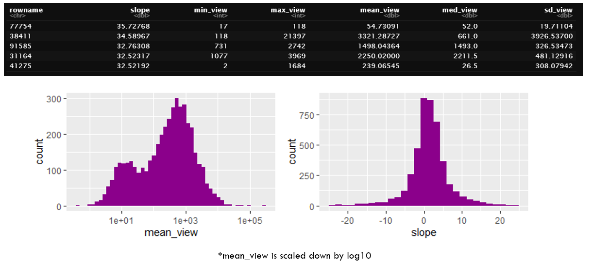
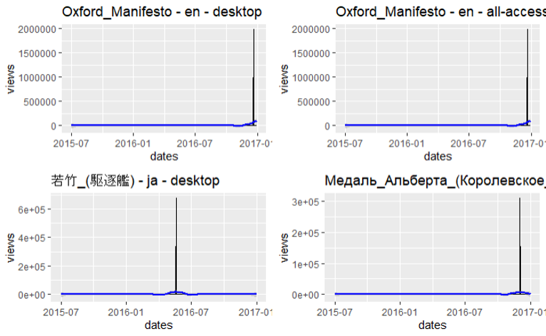
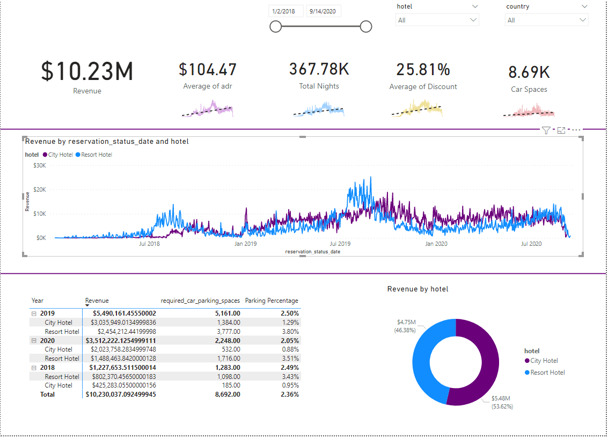

# Dane_Portfolio
Data Analytics | Data Science portfolio

# [Project 1: Web-Traffic-Forecasting---Capstone](https://github.com/DaneM2/Web-Traffic-Forecasting---Capstone)
This project looks at the problem of forecasting future values of time-series data. Wikipedia has over 145,000 articles and their view counts available to analyze. Following the Exploratory Data Analysis (EDA) process I was able to develop an Auto-Regressive Integrated Moving Average (ARIMA) model that showed a prediction of view counts for the following 45 – 60 days. Web forecasting is gaining popularity and has many applications including load balancing for cloud services, and understanding user behavior.

## What is Web Traffic Forecasting?
* Predict web traffic trends based on historic data
* Develop strategies for Load balancing applications
* Better understand user behavior

## Potential Customers
 Businesses looking for insights on web traffic to improve efficiency and gain a competitive edge\
 Forecasting is ubiquitous across industries:
 * Operations
 * Retail
 * Marketing
 * Logistics

## Exploratory Data Analysis (EDA)
### Software:
**R with Rstudio:** tidyverse, plotly, forecast, prophet, ggplot2, dplyr

## Data source:
Source: https://www.kaggle.com/c/web-traffic-time-series-forecasting/data \
Approximatley 145,000 time series:
* Daily page views, 2015-07-01 to 2016-12-31

## Cleaning and Transformation
* Checked for missing values using is.na 
* Seperated the date and pages to seperate tibbles for visualization
* Renamed and restructured page values to be easier to work with

### Time-series Extraction

## The Variables:
* locale data includes 7 languages: German, English, Spanish, French, Japanese, Russian, and Chinese
* Access: Platform used to view page
* Agent being a real person and spider being a bot used to index content

## Understanding Trends
### Looking for any trends in the distribution
* Broken down by min, max, mean, median, standard deviation, and slope

## Outliers
Clear examples of outliers. Zero views for all dates, spikes to over 10^6
 * tsclean() from forecast library does well with these values

## Model Selection - Arima
### Stands for Auto Regressive Integrated Moving Average
* **ARIMA** has 3 terms AR, I, and MA
* (AR) corresponds to Lags of the stationarized series
* (MA) corresponds to lags of the forecast error
* (I) corresponds to order of differencing of series to make it stationary
* Captures complex relationships through an iterative process of regressing a variable: Views ~ Dates\

*AR Model*: This model forecasts future values based on the immediate prior value in the time-series\
*MA Model*: equal to the past error multiplied by the coefficient

## Auto.Arima Results
### Prediction Length of 45 Days

## Residuals
* Strong p-value = 0 .017 (less than 0.05)
* Residuals are normally distributed
* Mostly absent of autocorrelation 

## Prophet Model
* Implementation of the Prophet library
* Non-linear trends are fitted with yearly seasonality effects

* Prophet components plotted
* Clear dip in views for middle of the year

## Improvements
* Include more relevant dates - Kaggle and API only provided up to 2016 
* Determine specific seasonality effects and tune accordingly
* Overall increase in model performance

## References
https://www.mediawiki.org/wiki/API:Main_page \
https://www.kaggle.com/c/web-traffic-time-series-forecasting \
https://www.rdocumentation.org/packages/forecast/versions/8.15/topics/auto.arima \
https://otexts.com/fpp2/arima-r.html \
https://plotly.com/ggplot2/ \
https://www.rstudio.com/wp-content/uploads/2015/02/data-wrangling-cheatsheet.pdf \
https://medium.com/swlh/wikipedia-web-traffic-time-series-forecasting-part-1-e43734adca3d \
https://people.duke.edu/~rnau/411arim.htm

---

# [Project 2: Multiple-Linear-Regression](https://github.com/DaneM2/Multiple-Regression-Project)
**Code is Linked to Title** 

Performed a multiple regression analysis on South Korea's GDP growth. South Korea in the 1950s came out of the Korean War, which left it's country ravaged and in extreme poverty. However, South Korea would go through one most significant economic developments the World has seen, taking it from a country in poverty to one of the top 15 economies in the World today.

   

# [Project 3: SQL-to-PowerBI](https://github.com/DaneM2/SQL-to-Power-BI-Project)
This is an example of providing important insights on hotel data:

1. Build a Database
2. Analyze and Retrieve Data with SQL
3. Connect Power BI to a Database
4. Visualize Data in Power BI

Used SQL to Join multiple years of hotel data together. Sorted the data to extract the relevant information. Imported aggregated data into Power BI. Created an Interactive Dashboard.

